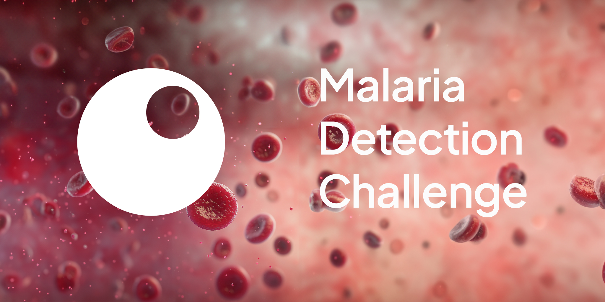
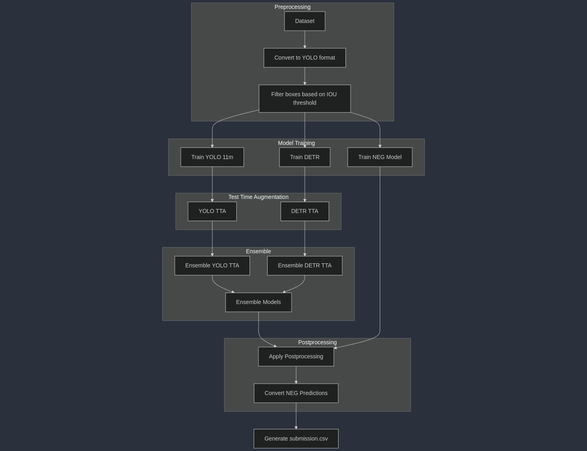

[](https://teamepoch.ai/competitions)
[](https://teamepoch.ai/)
[![Python Version](https://img.shields.io/badge/Python-3.10-4584b6.svg?logo=data:image/svg+xml;base64,PHN2ZyB4bWxucz0iaHR0cDovL3d3dy53My5vcmcvMjAwMC9zdmciIHdpZHRoPSI2NCIgaGVpZ2h0PSI2NCIgdmlld0JveD0iMCAwIDMyIDMyIj48ZGVmcz48bGluZWFyR3JhZGllbnQgaWQ9IkEiIHgxPSI4MTEuNTI3IiB5MT0iNTc0Ljg5NSIgeDI9IjY2NS4yNTUiIHkyPSI1NzMuNzMyIiBncmFkaWVudFVuaXRzPSJ1c2VyU3BhY2VPblVzZSI+PHN0b3Agb2Zmc2V0PSIwIiBzdG9wLWNvbG9yPSIjMzY2YTk2Ii8+PHN0b3Agb2Zmc2V0PSIxIiBzdG9wLWNvbG9yPSIjMzY3OWIwIi8+PC9saW5lYXJHcmFkaWVudD48bGluZWFyR3JhZGllbnQgaWQ9IkIiIHgxPSI4NjIuODI0IiB5MT0iNjQyLjE3NiIgeDI9IjU3My4yNzYiIHkyPSI2NDIuMTc2IiBncmFkaWVudFVuaXRzPSJ1c2VyU3BhY2VPblVzZSI+PHN0b3Agb2Zmc2V0PSIwIiBzdG9wLWNvbG9yPSIjZmZjODM2Ii8+PHN0b3Agb2Zmc2V0PSIxIiBzdG9wLWNvbG9yPSIjZmZlODczIi8+PC9saW5lYXJHcmFkaWVudD48L2RlZnM+PGcgdHJhbnNmb3JtPSJtYXRyaXgoLjE2MTcgMCAwIC4xNTgwODkgLTEwNy41Mzc2NCAtODEuNjYxODcpIj48cGF0aCBkPSJNNzE2LjI1NSA1NDQuNDg3YzAtMTMuNjIzIDMuNjUzLTIxLjAzNCAyMy44MjItMjQuNTYzIDEzLjY5My0yLjQgMzEuMjUtMi43IDQ3LjYyNyAwIDEyLjkzNSAyLjEzNSAyMy44MjIgMTEuNzcgMjMuODIyIDI0LjU2M3Y0NC45NDVjMCAxMy4xODItMTAuNTcgMjMuOTgtMjMuODIyIDIzLjk4aC00Ny42MjdjLTE2LjE2NCAwLTI5Ljc4NyAxMy43ODItMjkuNzg3IDI5LjM2M3YyMS41NjRoLTE2LjM3NmMtMTMuODUyIDAtMjEuOTE3LTkuOTg4LTI1LjMwNS0yMy45NjQtNC41Ny0xOC43NzYtNC4zNzYtMjkuOTYzIDAtNDcuOTQ1IDMuNzk0LTE1LjY4NyAxNS45MTctMjMuOTY0IDI5Ljc3LTIzLjk2NGg2NS41MnYtNmgtNDcuNjQ1di0xNy45OHoiIGZpbGw9InVybCgjQSkiLz48cGF0aCBkPSJNODExLjUyNyA2ODguMzJjMCAxMy42MjMtMTEuODIzIDIwLjUyMy0yMy44MjIgMjMuOTY0LTE4LjA1MiA1LjE4OC0zMi41NCA0LjM5NC00Ny42MjcgMC0xMi42LTMuNjctMjMuODIyLTExLjE3LTIzLjgyMi0yMy45NjR2LTQ0Ljk0NWMwLTEyLjkzNSAxMC43ODItMjMuOTggMjMuODIyLTIzLjk4aDQ3LjYyN2MxNS44NjQgMCAyOS43ODctMTMuNzEgMjkuNzg3LTI5Ljk2M3YtMjAuOTY0aDE3Ljg1OGMxMy44NyAwIDIwLjQgMTAuMzA1IDIzLjgyMiAyMy45NjQgNC43NjQgMTguOTcgNC45NzYgMzMuMTU3IDAgNDcuOTQ1LTQuODE3IDE0LjM2NC05Ljk3IDIzLjk2NC0yMy44MjIgMjMuOTY0SDc2My45djZoNDcuNjI3djE3Ljk4eiIgZmlsbD0idXJsKCNCKSIvPjxwYXRoIGQ9Ik03MjguMTY2IDU0MS41MDVjMC00Ljk3NiAzLjk4OC05IDguOTMtOSA0LjkyMyAwIDguOTMgNC4wMjMgOC45MyA5IDAgNC45Ni00LjAwNiA4Ljk4Mi04LjkzIDguOTgyLTQuOTQgMC04LjkzLTQuMDIzLTguOTMtOC45ODJ6bTUzLjU5IDE0OS43OThjMC00Ljk2IDQuMDA2LTguOTgyIDguOTMtOC45ODIgNC45NCAwIDguOTMgNC4wMjMgOC45MyA4Ljk4MiAwIDQuOTc2LTMuOTg4IDktOC45MyA5LTQuOTIzIDAtOC45My00LjAyMy04LjkzLTl6IiBmaWxsPSIjZmZmIi8+PC9nPjwvc3ZnPg==)](https://www.python.org/downloads/)
[](https://zindi.africa/)

# Lacuna Malaria Detection Challenge

This is Team Epoch's solution to
the [Lacuna Malaria Detection Challenge](https://zindi.africa/competitions/lacuna-malaria-detection-challenge), hosted
by Zindi.

The Public score achieved was : 0.92801233, and Private score: 0.92472582.

A technical report will be written and uploaded after the competition finale.

## Overview and objectives

This solution aims to tackle malaria challenges in Africa by assisting doctors in rapidly diagnosing infections with
minimal equipment. By automating the analysis of blood cell images, it reduces the need for manual examination of large
datasets, allowing healthcare professionals to focus on treatment and care.

The dataset, provided by Zindi and the Lacuna Fund, includes approximately 3,000 microscope images of blood cells. The
competition's goal is to identify and localize key objects within these images by drawing bounding boxes around three
classes:

- White Blood Cells (WBCs)
- Trophozoites
- Negative (NEG)

This project strives to make a meaningful impact on malaria diagnostics, particularly in resource-limited settings.

## End-to-End Machine Learning Workflow



This section outlines the process of extracting, transforming, modeling, and preparing predictions for submission in a
machine learning workflow.

---

### Preprocessing

1. **Dataset Preparation**:
    - Convert the dataset into YOLO format.
    - Filter bounding boxes using an IoU threshold to remove duplicate boxes.

2. **Data Extraction**:
    - Source data is extracted from the provided CSV files.

---

### Modeling

Three models are trained to perform specific tasks:

- **YOLO (11m)**: For general object detection.
- **DETR**: Another object detection model to complement YOLO.
- **NEG Model**: Specialized in identifying "NEG" images in predictions.

---

### Test-Time Augmentation (TTA)

After training, each model undergoes test-time augmentation using the following techniques:

- Horizontal Flip
- Vertical Flip
- Horizontal and Vertical Flip
- No Flip

The predictions for each augmentation are ensembled for every model.

---

### Ensembling

1. Ensemble the TTA predictions for each individual model.
2. Combine the ensembled predictions of all models into a unified set.

---

### Postprocessing

1. Apply techniques defined in `postprocessing.py`:
    - Use the **NEG Model** to adjust predictions by converting "NEG" predictions as needed.
    - Refine bounding boxes, labels, and confidence scores.

---

### Submission

The final predictions are exported to `submission.csv`, ready for submission.

---

### Notes

- For detailed parameter settings and methods, refer to the `postprocessing.py` script.
- For hyperparemeters refer to the config files located in : `config_files/detr_train_config_files`
  and `config_files/yolo_train_config_files`.
- The pipeline ensures an organized flow from raw data to final predictions.
- Models were validated using our own map calculation located in : `util/mAP_zindi.py`

## Getting started

This section contains the steps that need to be taken to get started with our project and fully reproduce our best
submission on the public and private leaderboard. The project was developed on Ubuntu 22.04, and on Python 3.10.

### Prerequisites

Models were trained on machine with the following specifications:

- CPU: AMD Ryzen 9 7950X 16-Core Processor
- GPU: NVIDIA RTX Quadro 6000
- RAM: 96GB
- OS: Ubuntu 22.04
- Python: 3.10.12
- Estimated training time: 7-8 hours for the DETR, 2-3 hours for YOLO.

### 1. Clone the repository

Make sure to clone the repository with your favourite git client or using the following command:

```
https://github.com/TeamEpochGithub/ZindiLacunaMalaria.git
```

### Install Python 3.10

You can install the required python version here: [Python 3.10](https://www.python.org/downloads/release/python-31015/)

### Install the required packages

Install the required packages (on a virtual environment is recommended) using the following command:

```
python3 -m venv .venv
source .venv/bin/activate
pip install -r requirements.txt
```

### Setup the competition data

The data of the competition can be downloaded
here: [Lacuna Malaria Detection Challenge](https://zindi.africa/competitions/lacuna-malaria-detection-challenge/data)

Unzip all csv files into the `data/csv_files` directory, and all images into the `data/img` directory.

The structure should look like this:

```
data/
    ├── csv_files/
        ├── Train.csv
        ├── Test.csv
    ├── img/
        ├── id_xxxxxxxx.jpg
        ├── ...
    
```

### Main file explanation

- `main.py`: This runs the entire end-to-end solution elaborated earlier.

## Inference and Deployment

The script `inference.py` enables quick deployment and prediction.

## Maintenance and monitoring:

Regularly audit ETL pipelines for data integrity and scalability, and monitor model metrics (e.g., precision, recall,
mAP) to detect performance drift. Automate retraining triggers and validate postprocessing logic, such as NEG model
adjustments, to ensure consistent outputs.

Leverage cloud platforms for scalability, and use CI/CD pipelines for efficient model updates. Integrate new data into
workflows and retrain models as needed. Implement drift detection and maintain documentation to support long-term
usability and accessibility for healthcare practitioners. Note: use only the yolo models if implementing for a phone
app.

## Contributors

This repository was created by [Team Epoch V](https://teamepoch.ai/team#v), based in
the [Dream Hall](https://www.tudelft.nl/ddream) of the [Delft University of Technology](https://www.tudelft.nl/).


Read more about this competition [here](https://teamepoch.ai/competitions).

Marcin Jarosz,&nbsp;&nbsp; Madhav Venkatesh,&nbsp;&nbsp; Felipe Bononi Bello,&nbsp;&nbsp; Kenzo Heijman.

[](https://github.com/MarJarAI)
[](https://github.com/madhavv197)
[](https://github.com/FBB0)
[](https://github.com/Blagues)
